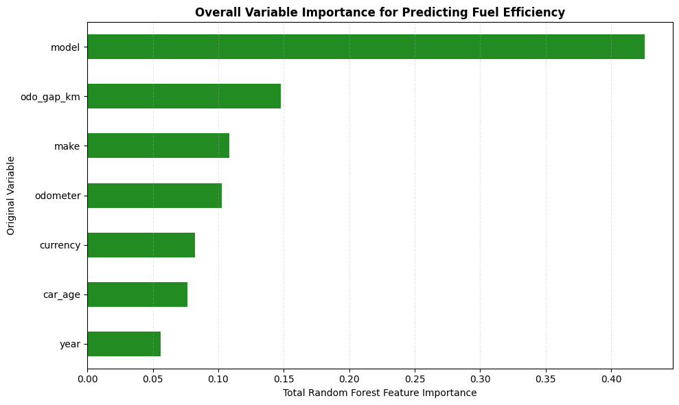

# Fuel Logbook Analytics & EDA 🚗⚓📊


A comprehensive data science pipeline for cleaning, transforming, and statistically analyzing a global dataset of vehicle fuel logs. This project addresses common real-world data issues—including mixed currencies, missing values, locale unit differences, and corrupted inputs—to extract insights on vehicle efficiency and driver behavior.

---

## 📌 Project Overview

Vehicle fuel logging platforms often suffer from noisy, user-submitted data. This repository provides an end-to-end Exploratory Data Analysis (EDA) and cleaning pipeline designed to process real-world fill-up records. Key analysis areas include:

* **Data Cleaning & Imputation:** Systematically handling missing values across gallons, miles, and mpg using mathematical interdependencies.
* **Feature Engineering & Unit Normalization:** Extracting vehicle attributes (Make, Model, Year, User ID) from scraped URLs and normalizing UK/US gallon variations into standard metric units ($\text{L/100km}$, Litres, Kilometres).
* **Multi-Layer Outlier Detection:** Applying currency-specific Tukey bounds ($1.5 \times \text{IQR}$) integrated with physical safety thresholds to strip erroneous transactions[cite: 1].
* **Predictive & Statistical Modeling:** Utilizing ANOVA tests and Random Forest feature importances to determine key drivers of vehicle fuel efficiency[cite: 1].
* **Behavioral Hypothesis Testing:** Evaluating fuel-buying behaviors in South Africa around scheduled monthly fuel price adjustments using non-parametric statistical tests (Mann-Whitney U)[cite: 1].

---

## 🛠 Tech Stack & Tools

* **Language:** Python 3.x
* **Data Processing & Manipulation:** Pandas, NumPy
* **Data Visualization:** Matplotlib, Seaborn
* **Machine Learning & Statistics:** Scikit-Learn (Random Forest), SciPy (Mann-Whitney U, ANOVA)
* **Environment:** Jupyter Notebook

---

## 🔍 Key Findings & Highlights



* **Primary Driver of Fuel Efficiency:** Random Forest feature importances and ANOVA tests ($\eta^2 = 0.577$, $p < 0.000001$) confirmed that **vehicle model** is the single most decisive factor determining fuel consumption ($\text{L/100km}$)[cite: 1].
* **Outlier Removal Precision:** Filtered **12.32%** of top-currency transactions across three structured cleaning layers (reclaiming mislabelled USD/ZAR records, verifying total spent integrity, and enforcing physical bounds)[cite: 1].
* **South African Driver Psychology:** Hypothesis testing revealed that drivers significantly increase fill-ups on the **first Tuesday** of a month prior to an announced price increase ($p = 0.0001$)[cite: 1]. Conversely, drivers do not wait until Wednesday when prices drop ($p = 0.1366$), demonstrating asymmetrical loss aversion[cite: 1].

---

## 📂 Repository Structure

```text
├── data/                  # Raw and processed datasets
├── source_code/             # Exploratory notebooks with full-scale visual plots
├── Fuel_efficiency_Report.pdf       # Formal academic preprint & detailed findings report
└── README.md              # Project documentation
